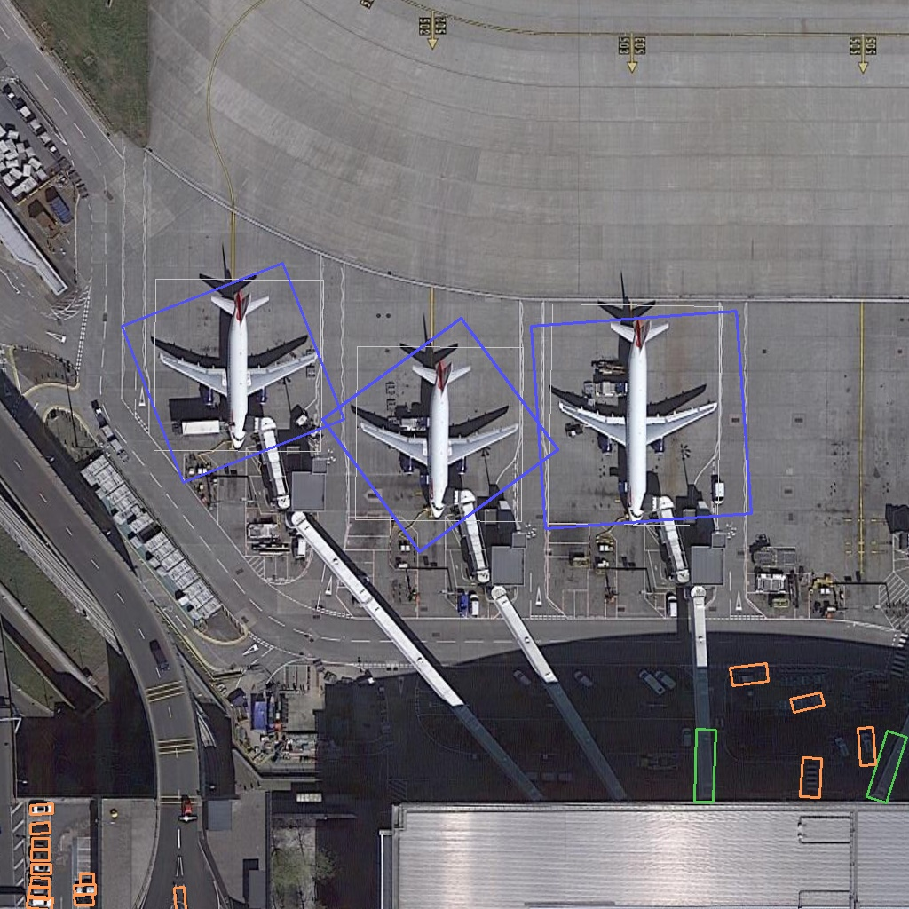
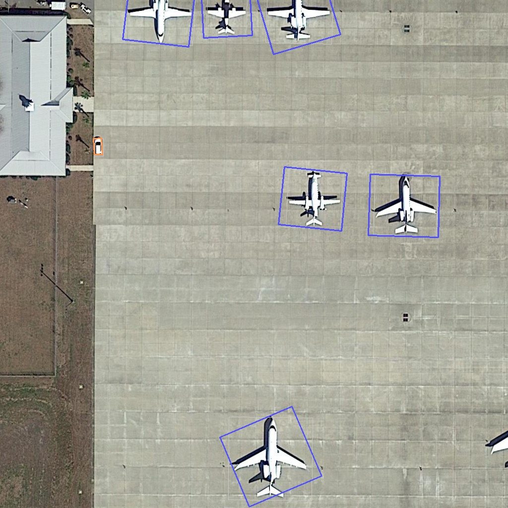
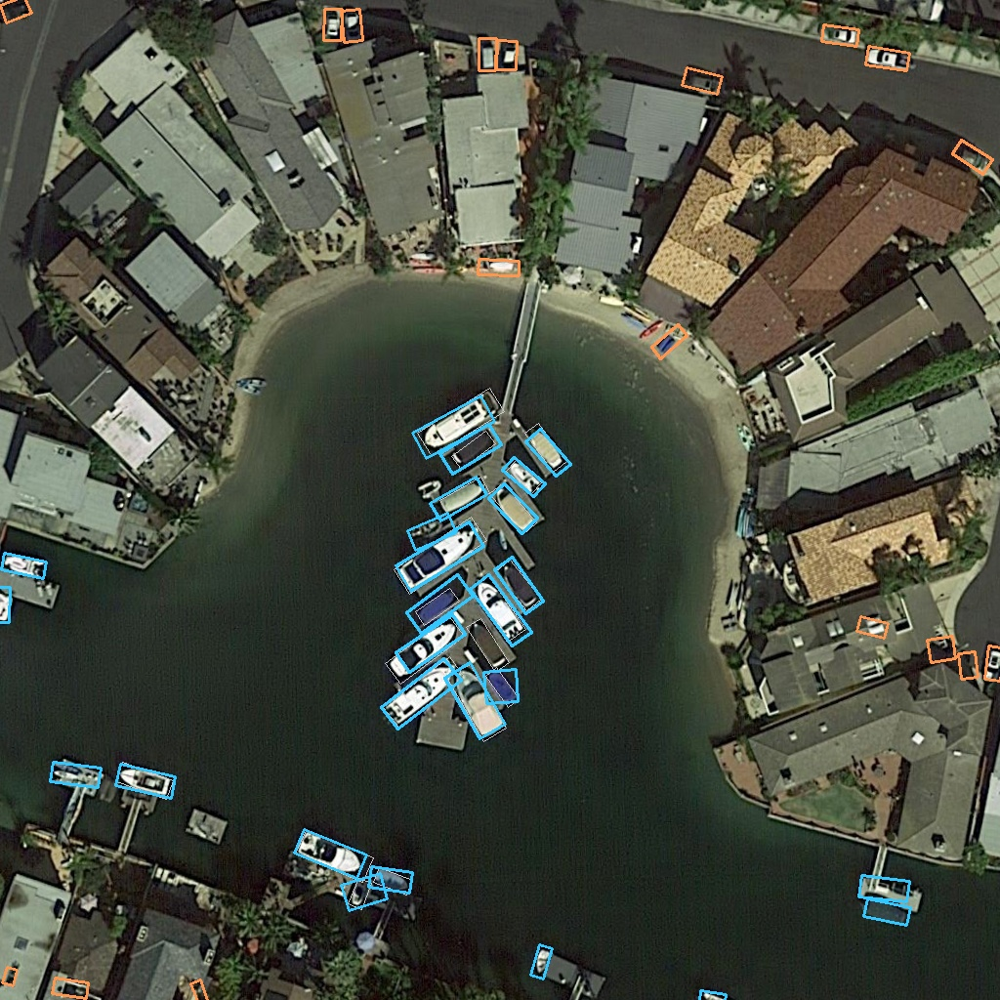
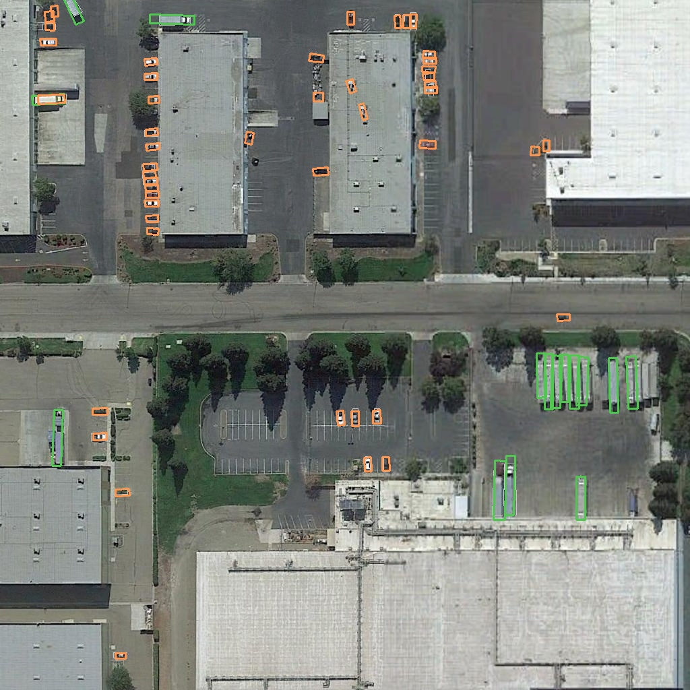

# CSPPartial-YOLO 重現

用 PyTorch 從頭重現這篇論文：

> *A Lightweight YOLO-Based Method for Typical Objects Detection in Remote Sensing Images*
> IEEE JSTARS, 2024

論文沒有放出官方程式碼（原作是 PaddlePaddle），所以這份實作是照論文的圖表跟公式自己刻出來的。任務是 DOTA 遙感影像的旋轉框偵測，做了 plane、large-vehicle、small-vehicle、ship 四類。

## 偵測效果

| 機場 | 停機坪（多角度） |
|:---:|:---:|
|  |  |

| 港灣 | 停車場 |
|:---:|:---:|
|  |  |

旋轉框顏色：🔵 plane　🟢 large-vehicle　🟠 small-vehicle　🟡 ship。灰色細框是 ground truth。

## 結果

在 DOTA val（1854 張）上跑出來的數字，跟論文對一下：

| | 論文 | 這份 |
|------|:-------:|:-------:|
| mAP@0.5 | 89.75% | 81.48% |
| FLOPs | 16.2 G | 16.1 G |
| Params | ~6.5 M | 6.52 M |

mAP 還差論文 8 個百分點左右，但 FLOPs 跟參數量基本上對上了。各類別分開看：

| 類別 | AP |
|-------|---:|
| plane | 89.79% |
| ship | 84.71% |
| large-vehicle | 79.24% |
| small-vehicle | 72.18% |

plane 最好，small-vehicle 最差——小物體本來就比較難，旋轉框又對角度精度更敏感。

差距主要來自 label assignment：論文用的是 TALA，我試過但冷啟動會卡死（初期角度亂跳，IoU 全是 0，模型直接學會什麼都不輸出），最後退回用 AABB 選正樣本才穩定收斂。其他像角度回歸、切圖 overlap 這些細節論文沒寫清楚，也只能照描述推。

## 架構

```
Input (3×1024×1024)
  → CSPPartialNet (Backbone)   cp_ratio=0.25, MaxPool 降採樣
      p3 / p4 / p5
  → CSPPartialFPN (Neck)       top-down + bottom-up, PHDC block
  → PPYOLOERHead (Head)        DFL 回歸 + 1 維角度 + VFL 分類
  → 旋轉框 (cx, cy, w, h, θ) × 4 類
```

6.52M 參數，16.1G FLOPs。Backbone 每個 stage 都有 Coordinate Attention。

## 環境

```bash
python -m venv venv && source venv/bin/activate
pip install -r requirements.txt
pip install mmcv==2.1.0 -f https://download.openmmlab.com/mmcv/dist/cu121/torch2.1/index.html
```

主要依賴是 torch 2.1.2 + cu121，mmcv 2.1.0 用來算旋轉框 IoU 跟 NMS。

## 資料準備

DOTA v1.0 下載後切圖（大圖太大塞不進顯卡，切成 1024×1024 的 patch，重疊 200px）：

```bash
python datasets/dota_preprocess.py \
  --src_img /path/to/DOTA/train/images \
  --src_ann /path/to/DOTA/train/labelTxt \
  --dst     datasets/dota/dota/train \
  --size 1024 --overlap 200
```

val 同樣處理，路徑換成 val 就好。實際參數請以 `datasets/dota_preprocess.py` 的 argparse 為準。

## 訓練

```bash
python train.py \
  --train_dir datasets/dota/dota/train \
  --val_dir   datasets/dota/dota/val \
  --output    checkpoints \
  --epochs 300 --batch 28 --lr 0.010 --warmup 10 --workers 4 \
  --dota_only_val
```

RTX 4080 上一個 epoch 大概 3 分鐘，跑完 300 epoch 約十幾個小時。

## 評估

```bash
python eval.py \
  --val_dir datasets/dota/dota/val \
  --weights checkpoints/best_model_map.pt \
  --batch 8 --score_thr 0.05 --nms_thr 0.1 \
  --dota_only_val
```

## 視覺化

```bash
python visualize.py \
  --weights checkpoints/best_model_map.pt \
  --val_dir datasets/dota/dota/val \
  --out demo --n 8 --score_thr 0.25
```

## 權重

`checkpoints/best_model_map.pt`，epoch 210 的存檔，mAP@0.5 = 81.48%。
